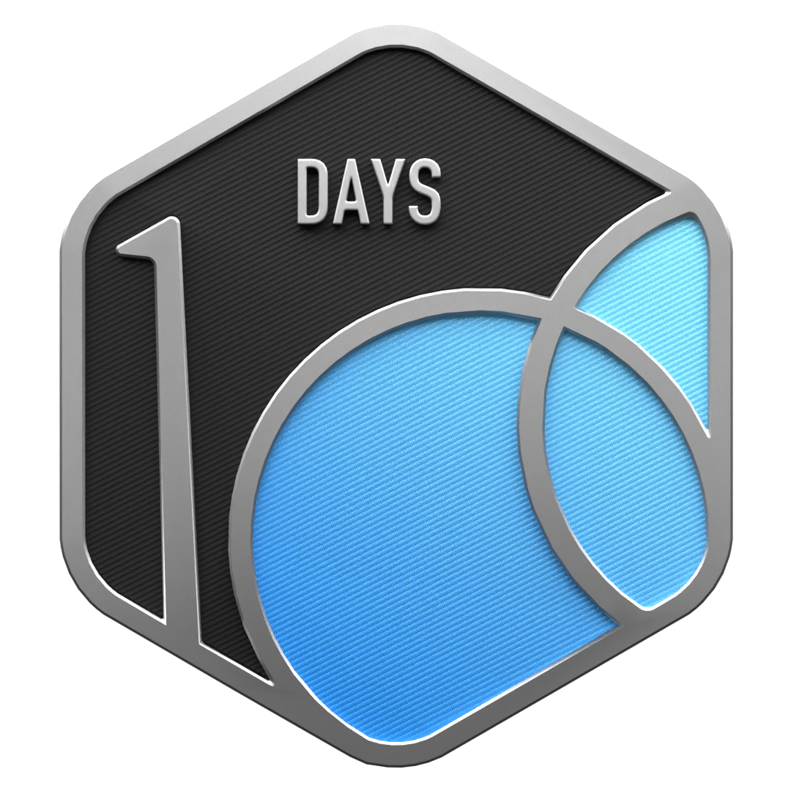

<!-- Header Wave Animation -->

  
   
  
  <h1>Hi there, I'm Kush Kumar</h1>
  
  
  

    
    
    
    
  

---

## 👨‍💻 About Me

I'm a software developer specializing in full-stack web development with the MERN stack. Currently pursuing a Bachelor of Vocation in Software Development at Ramanujan College, Delhi University. I build scalable web applications, solve algorithmic problems daily, and create educational content about software development.

---

  

## YouTube Channel: [@sudoinitialize](https://www.youtube.com/@sudoinitialize)

> **Initializing the development environment.**
> 
> Welcome to \`@sudoinitialize\`. I'm Kush, a full-stack software developer exploring system architecture, modern web technologies, and the logic behind the code. On this channel, we break down complex engineering concepts from the ground up—using digital whiteboards to map out microservices, component architecture, and deep-dive system designs.  
> 
> Expect clean logic, zero fluff, and scalable builds. Execute the subscribe command and let's get to work.

  

 

### 🎬 Latest Videos
<!-- YOUTUBE:START -->

<!-- YOUTUBE:END -->

---

##  LeetCode Stats

  

  
  

---

##  GitHub Stats

  
  

  

---

##  Tech Stack

  

---

##  Open Source / Projects

  <h3>GSSoC 2026</h3>
  
  

 

- [**batiyoun**](https://github.com/kushkumarkashyap7280/batiyoun) - Open-source PWA (offline-first, native-like single platform app). Uses the `kush-e2e` package for end-to-end flows.
- [**kush-e2e**](https://www.npmjs.com/package/kush-e2e) (NPM Package) 

---

  
   
  <i>Let's connect and build something amazing together!</i>
   
   
  

<!-- Footer Wave Animation -->

